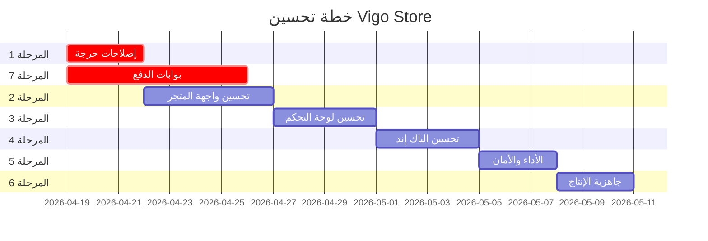

# 🏗️ Vigo Store — خطة التحسين الشاملة

> **المشروع:** Vigo Store v3 — متجر إلكتروني للملابس موجه للسوق المصري  
> **التقنيات:** Nuxt 4 + Vue 3 + Prisma + PostgreSQL + Tailwind CSS  
> **تاريخ الإعداد:** 18 أبريل 2026

---

## 📊 الحالة الحالية للمشروع

| المنطقة | الحالة | التقييم |
|---------|--------|---------|
| الصفحة الرئيسية (Home) | ✅ يعمل | 7/10 |
| صفحة المنتجات (Shop All) | ✅ يعمل | 7/10 |
| تفاصيل المنتج (Product Details) | ✅ يعمل | 8/10 |
| السلة (Cart) | ✅ يعمل | 6/10 |
| الدفع (Checkout) | ✅ يعمل | 7/10 |
| صفحة من نحن (About) | ✅ يعمل | 6/10 |
| لوحة التحكم (Admin Dashboard) | ✅ يعمل | 7/10 |
| نظام المستخدمين والصلاحيات | ✅ يعمل | 7/10 |
| API الخلفية | ✅ يعمل | 6/10 |
| قاعدة البيانات (Schema) | ✅ يعمل | 7/10 |
| الأمان | ⚠️ يحتاج تحسين | 5/10 |
| الأداء (Performance) | ⚠️ يحتاج تحسين | 5/10 |
| SEO | ⚠️ يحتاج تحسين | 4/10 |
| الموبايل (Responsive) | ⚠️ يحتاج تحسين | 5/10 |
| جاهزية الإنتاج (Production) | ❌ غير جاهز | 3/10 |

---

## 🎯 المرحلة 1: إصلاحات حرجة وأولويات عاجلة
**المدة المتوقعة:** 2-3 أيام | **الأولوية:** 🔴 عالية جداً

### 1.1 إصلاح الـ Navbar المكرر ← كومبوننت موحد
- [ ] إنشاء `components/storefront/TheNavbar.vue` كومبوننت واحد
- [ ] إنشاء `components/storefront/TheFooter.vue` كومبوننت واحد
- [ ] حذف الـ Navbar و Footer المكرر من كل صفحة (`index.vue`, `products/index.vue`, `products/[slug].vue`, `checkout/index.vue`, `about.vue`, `account.vue`, `cart.vue`)
- [ ] استخدام `layouts/default.vue` لتضمين الـ Navbar والـ Footer تلقائياً

> [!IMPORTANT]
> حالياً الـ Navbar مكتوب يدوياً في **7 صفحات مختلفة**. أي تعديل في الـ Navbar يتطلب تعديل 7 ملفات! هذا أكبر مشكلة صيانة في المشروع.

### 1.2 إصلاح صفحة تعديل المنتج (Edit Product)
- [ ] إضافة حقول الألوان والمقاسات لصفحة `admin/products/[id]/edit.vue` (حالياً موجودة فقط في Create)
- [ ] تغيير عملة السعر من `$` إلى `EGP`
- [ ] إضافة حقل `discount` و `isFeatured` و `isActive` في نموذج التعديل

### 1.3 السلة (Cart) — تحسينات أساسية
- [ ] حفظ السلة في `localStorage` بدلاً من `useState` فقط (حتى لا تُمسح عند تحديث الصفحة)
- [ ] عرض عدد عناصر السلة كـ Badge فوق أيقونة السلة في الـ Navbar
- [ ] منع إضافة نفس المنتج بنفس اللون والمقاس مرتين (زيادة الكمية بدلاً من ذلك)

### 1.4 إصلاح الأمان الأساسي
- [ ] إضافة CSRF protection
- [ ] تقوية الـ auth middleware ضد التلاعب بالـ tokens
- [ ] إضافة rate limiting للـ API endpoints الحساسة (login, register, checkout)
- [ ] التأكد من أن الـ Stripe Secret Key **لا يتم إرسالها** للـ client أبداً

---

## 🎨 المرحلة 2: تحسين واجهة المتجر (Storefront UI)
**المدة المتوقعة:** 4-5 أيام | **الأولوية:** 🟠 عالية

### 2.1 الصفحة الرئيسية (Home)
- [ ] إضافة سلايدر ديناميكي للـ Hero Section (يسحب الصور من لوحة التحكم)
- [ ] إضافة قسم "Best Sellers" يعرض أكثر المنتجات طلباً
- [ ] إضافة قسم "New Arrivals" يعرض أحدث المنتجات
- [ ] إضافة قسم التصنيفات (Categories) ككروت بصورة تعبيرية
- [ ] إضافة شريط "Free Shipping on orders above X EGP"
- [ ] إضافة قسم مراجعات العملاء (Testimonials)
- [ ] تفعيل الـ Newsletter signup مع حفظ الإيميلات في الباك إند

### 2.2 صفحة المنتجات (Shop All)
- [ ] إضافة فلتر بالسعر (Price Range Slider)
- [ ] إضافة فلتر بالألوان
- [ ] إضافة فلتر بالمقاسات المتاحة
- [ ] إضافة ترتيب (Sort): الأحدث، الأرخص، الأغلى، الأكثر مبيعاً
- [ ] إضافة Pagination أو Infinite Scroll بدلاً من تحميل كل المنتجات مرة واحدة
- [ ] إضافة زر "Quick Add to Cart" يظهر عند Hover على كارت المنتج
- [ ] تحسين تصميم كارت المنتج لعرض الخصم إن وُجد (مثلاً: ~~500 EGP~~ → 350 EGP)

### 2.3 صفحة تفاصيل المنتج
- [ ] إضافة Zoom للصورة عند Hover
- [ ] إضافة عداد الكمية (Quantity Selector) قبل "Add to Bag"
- [ ] عرض حالة المخزون (In Stock / Low Stock / Out of Stock)
- [ ] عرض الخصم بشكل بارز مع السعر قبل وبعد
- [ ] إضافة نظام مراجعات وتقييمات العملاء (Stars Rating)
- [ ] إضافة أزرار المشاركة على السوشيال ميديا
- [ ] إضافة Breadcrumb ديناميكي يعرض التصنيف الصحيح

### 2.4 تجربة الموبايل (Mobile Responsive)
- [ ] إضافة Hamburger Menu للـ Navbar على الموبايل
- [ ] تحسين تصميم صفحة المنتج على الموبايل (Gallery بالـ Swipe)
- [ ] تحسين صفحة الدفع للشاشات الصغيرة
- [ ] إضافة زر "Back to Top" عائم
- [ ] تحسين حجم الخطوط والـ Touch Targets للموبايل

### 2.5 إضافة صفحات جديدة
- [ ] صفحة "تتبع الطلب" (`/orders/:id`) — للعميل لمتابعة حالة طلبه
- [ ] صفحة "طلباتي" (`/orders`) — قائمة بكل طلبات العميل
- [ ] صفحة "قائمة الأمنيات" (Wishlist) — حفظ المنتجات المفضلة
- [ ] صفحة 404 مخصصة وجميلة
- [ ] صفحة سياسة الخصوصية والشروط والأحكام

---

## ⚙️ المرحلة 3: تحسين لوحة التحكم (Admin Dashboard)
**المدة المتوقعة:** 3-4 أيام | **الأولوية:** 🟡 متوسطة-عالية

### 3.1 Dashboard الرئيسي
- [ ] إنشاء صفحة `admin/dashboard` فعلية تعرض:
  - إجمالي المبيعات اليومية/الأسبوعية/الشهرية
  - عدد الطلبات الجديدة
  - عدد المنتجات (نشط / مؤرشف / نفد المخزون)
  - رسم بياني للمبيعات (Chart.js أو ApexCharts)
  - آخر 5 طلبات
  - أكثر المنتجات مبيعاً

### 3.2 إدارة الطلبات
- [ ] إضافة تفاصيل الطلب في مودال أو صفحة منفصلة
- [ ] إمكانية تحديث حالة الطلب (Pending → Shipped → Delivered)
- [ ] إمكانية طباعة فاتورة الطلب (Print Invoice)
- [ ] إضافة فلترة بالحالة والتاريخ
- [ ] إضافة بحث بالاسم أو رقم الطلب
- [ ] إضافة عنوان الشحن ورقم التليفون في تفاصيل الطلب

### 3.3 إدارة المنتجات
- [ ] إضافة Bulk Actions (حذف متعدد، تفعيل/تعطيل متعدد)
- [ ] إضافة Import/Export للمنتجات (CSV)
- [ ] تحسين رفع الصور: ضغط الصور تلقائياً قبل الرفع
- [ ] إضافة Drag & Drop لترتيب صور المنتج
- [ ] إضافة Product Variants (مثلاً: نفس المنتج بمقاسات مختلفة بأسعار مختلفة)

### 3.4 الإعدادات
- [ ] إضافة إعدادات الشحن بالمحافظات المصرية (كل محافظة بتكلفة شحن مختلفة)
- [ ] إعدادات الإشعارات (إيميل عند طلب جديد)
- [ ] إدارة البانرات والسلايدرات للصفحة الرئيسية
- [ ] إعدادات الكوبونات والخصومات (Promo Codes)

---

## 🔧 المرحلة 4: تحسين الباك إند والـ API
**المدة المتوقعة:** 3-4 أيام | **الأولوية:** 🟡 متوسطة

### 4.1 تحسين قاعدة البيانات (Schema)
- [ ] إضافة جدول `Address` منفصل لعناوين الشحن
- [ ] إضافة جدول `Review` للمراجعات والتقييمات
- [ ] إضافة جدول `Wishlist` لقائمة الأمنيات
- [ ] إضافة جدول `Coupon` لأكواد الخصم
- [ ] إضافة جدول `Banner` لسلايدرات الصفحة الرئيسية
- [ ] إضافة حقل `phone` في جدول `User`
- [ ] إضافة حقل `shippingAddress` كـ JSON في جدول `Order`
- [ ] إضافة جدول `ActivityLog` لتتبع أنشطة الأدمن

```prisma
// اقتراح إضافات للـ Schema
model Review {
  id        String   @id @default(cuid())
  userId    String
  user      User     @relation(fields: [userId], references: [id])
  productId String
  product   Product  @relation(fields: [productId], references: [id])
  rating    Int      // 1-5
  comment   String?
  createdAt DateTime @default(now())
}

model Coupon {
  id             String   @id @default(cuid())
  code           String   @unique
  discountType   String   // "PERCENTAGE" or "FIXED"
  discountValue  Float
  minOrderAmount Float?
  maxUses        Int?
  usedCount      Int      @default(0)
  isActive       Boolean  @default(true)
  expiresAt      DateTime?
  createdAt      DateTime @default(now())
}

model Wishlist {
  id        String   @id @default(cuid())
  userId    String
  user      User     @relation(fields: [userId], references: [id])
  productId String
  product   Product  @relation(fields: [productId], references: [id])
  createdAt DateTime @default(now())
  @@unique([userId, productId])
}
```

### 4.2 تحسين الـ API Endpoints
- [ ] إضافة Validation لكل الـ endpoints باستخدام `zod`
- [ ] إضافة Error Handling موحد بـ custom error classes
- [ ] إضافة API Pagination لكل الـ list endpoints
- [ ] إضافة Search و Filtering على مستوى الـ API (بدلاً من الـ client-side فقط)
- [ ] إضافة Caching للبيانات الثابتة (Settings, Categories)
- [ ] إنشاء API endpoints للـ:
  - `POST /api/orders` — إنشاء طلب جديد (مع التحقق من المخزون)
  - `GET /api/orders/my` — طلباتي
  - `POST /api/reviews` — إضافة مراجعة
  - `POST /api/wishlist` — إضافة للأمنيات
  - `POST /api/coupons/validate` — التحقق من كوبون الخصم
  - `GET /api/products/bestsellers` — أكثر المنتجات مبيعاً

### 4.3 نظام الإشعارات
- [ ] إشعار للأدمن عند وصول طلب جديد (Real-time via SSE أو WebSocket)
- [ ] إشعار بالإيميل عند تأكيد الطلب
- [ ] إشعار للعميل عند تحديث حالة طلبه

---

## 🚀 المرحلة 5: الأداء والـ SEO والأمان
**المدة المتوقعة:** 2-3 أيام | **الأولوية:** 🟡 متوسطة

### 5.1 تحسين الأداء (Performance)
- [ ] تفعيل SSR لصفحات المتجر (حالياً بعض الصفحات client-only)
- [ ] إضافة Image Optimization: استخدام `<NuxtImg>` بدلاً من `` العادية
- [ ] تحسين حجم الـ Bundle: lazy loading للمكونات الكبيرة
- [ ] إضافة Service Worker للـ Offline Support
- [ ] ضغط الصور المرفوعة تلقائياً (Sharp أو Cloudinary)
- [ ] إضافة CDN للصور والملفات الثابتة
- [ ] تحسين Database Queries: إضافة `select` لتحديد الحقول المطلوبة فقط

### 5.2 تحسين الـ SEO
- [ ] إضافة `<meta>` tags ديناميكية لكل صفحة منتج
- [ ] إضافة Open Graph tags للمشاركة على السوشيال ميديا
- [ ] إضافة JSON-LD Schema (Product, BreadcrumbList, Organization)
- [ ] إنشاء `sitemap.xml` تلقائي
- [ ] إنشاء `robots.txt`
- [ ] إضافة Canonical URLs
- [ ] تحسين الـ URL slugs لتكون SEO-friendly

### 5.3 الأمان المتقدم
- [ ] إضافة Helmet headers (X-Frame-Options, CSP, etc.)
- [ ] تشفير البيانات الحساسة في قاعدة البيانات
- [ ] إضافة 2FA (Two-Factor Authentication) للأدمن
- [ ] تسجيل محاولات الدخول الفاشلة مع حظر مؤقت
- [ ] فحص الـ Input ضد SQL Injection و XSS
- [ ] إخفاء Stack Traces في الـ Production

---

## 🌍 المرحلة 6: جاهزية الإنتاج والنشر
**المدة المتوقعة:** 2-3 أيام | **الأولوية:** 🟢 عند الجاهزية

### 6.1 التجهيز للنشر
- [ ] إعداد ملف `.env.production` بالمتغيرات الصحيحة
- [ ] إعداد Docker Compose للنشر (Nuxt + PostgreSQL + Redis)
- [ ] إعداد Nginx كـ Reverse Proxy
- [ ] إعداد SSL Certificate (Let's Encrypt)
- [ ] إعداد CI/CD Pipeline (GitHub Actions أو GitLab CI)
- [ ] إعداد Backup تلقائي لقاعدة البيانات

### 6.2 المراقبة والصيانة
- [ ] إعداد Error Tracking (Sentry)
- [ ] إعداد Uptime Monitoring
- [ ] إعداد Performance Monitoring
- [ ] إعداد Database Monitoring
- [ ] إعداد Log Management

### 6.3 تكاملات إضافية
- [ ] ربط WhatsApp API للإشعارات
- [ ] ربط Google Analytics
- [ ] ربط Facebook Pixel للتسويق

---

## 💳 المرحلة 7: نظام بوابات الدفع ومراقبة المعاملات
**المدة المتوقعة:** 5-7 أيام | **الأولوية:** 🔴 عالية جداً

> [!IMPORTANT]
> تم إعداد وثيقة متطلبات تفصيلية لهذه المرحلة في ملف منفصل:
> **PAYMENT_GATEWAY_SETTINGS_REQUIREMENTS.md**
> الوثيقة تحتوي على 12 قسم تفصيلي شامل لكل المتطلبات.

### 7.1 صفحة إعدادات بوابات الدفع (Payment Gateway Settings)
- [ ] إنشاء صفحة `admin/settings/payment-gateways`
- [ ] إعداد نموذج إعدادات **Paymob** كأول بوابة دفع
- [ ] تشفير البيانات الحساسة (API Keys, Secrets) في قاعدة البيانات
- [ ] إخفاء القيم الحساسة في الـ UI مع زر إظهار/إخفاء
- [ ] Validation كامل لكل الحقول
- [ ] Audit Log لتتبع تغييرات الإعدادات

### 7.2 إضافة جداول قاعدة البيانات
- [ ] إنشاء جدول `PaymentGateway` لتخزين إعدادات البوابات
- [ ] إنشاء جدول `PaymentTransaction` لتسجيل كل المعاملات
- [ ] تشغيل الـ Migration

### 7.3 صفحة مراقبة المعاملات (Transactions Monitoring)
- [ ] إنشاء صفحة `admin/payments` لعرض جميع المعاملات
- [ ] جدول يعرض: Transaction ID, Order, Customer, Provider, Amount, Status
- [ ] بحث وفلترة بـ Status, Provider, Date Range
- [ ] KPI Summary Cards (إجمالي المعاملات، الناجحة، الفاشلة، الإيرادات)
- [ ] تفاصيل المعاملة: Gateway Response + Status Timeline
- [ ] Pagination + Export CSV

### 7.4 التكامل الفعلي مع Paymob
- [ ] إنشاء Server-side Adapter لـ Paymob API
- [ ] عرض Iframe الدفع في صفحة Checkout
- [ ] Webhook endpoint لاستقبال تأكيدات الدفع
- [ ] التحقق من HMAC Signature
- [ ] تحديث حالة الطلب تلقائياً عند تأكيد الدفع

### 7.5 قابلية التوسع
- [ ] بنية Provider-Agnostic (إضافة Stripe/PayPal لاحقاً بدون تغيير UI)
- [ ] TypeScript Interface لكل Provider Adapter

---

## 📋 ملخص الأولويات



---

## 🔢 إحصائيات المهام

| المرحلة | عدد المهام | الأولوية | المدة المتوقعة |
|---------|-----------|----------|---------------|
| المرحلة 1: إصلاحات حرجة | 16 مهمة | 🔴 عالية جداً | 2-3 أيام |
| المرحلة 7: بوابات الدفع | 22 مهمة | 🔴 عالية جداً | 5-7 أيام |
| المرحلة 2: واجهة المتجر | 28 مهمة | 🟠 عالية | 4-5 أيام |
| المرحلة 3: لوحة التحكم | 16 مهمة | 🟡 متوسطة-عالية | 3-4 أيام |
| المرحلة 4: الباك إند | 18 مهمة | 🟡 متوسطة | 3-4 أيام |
| المرحلة 5: الأداء والأمان | 16 مهمة | 🟡 متوسطة | 2-3 أيام |
| المرحلة 6: النشر | 11 مهمة | 🟢 عند الجاهزية | 2-3 أيام |
| **الإجمالي** | **127 مهمة** | | **21-29 يوم عمل** |

---

## 📎 المستندات المرفقة

| المستند | الوصف |
|---------|-------|
| **PAYMENT_GATEWAY_SETTINGS_REQUIREMENTS.md** | وثيقة متطلبات تفصيلية لبوابات الدفع ومراقبة المعاملات — 12 قسم يشمل: Paymob Config, Data Structures, Security, UI Wireframes, Validation, Acceptance Criteria |

---

> [!TIP]
> ابدأ بالمرحلة 1 والمرحلة 7 بالتوازي — المرحلة 1 تحل مشاكل الصيانة، والمرحلة 7 تفعّل الدفع الإلكتروني وهو أساسي لإطلاق المتجر.

